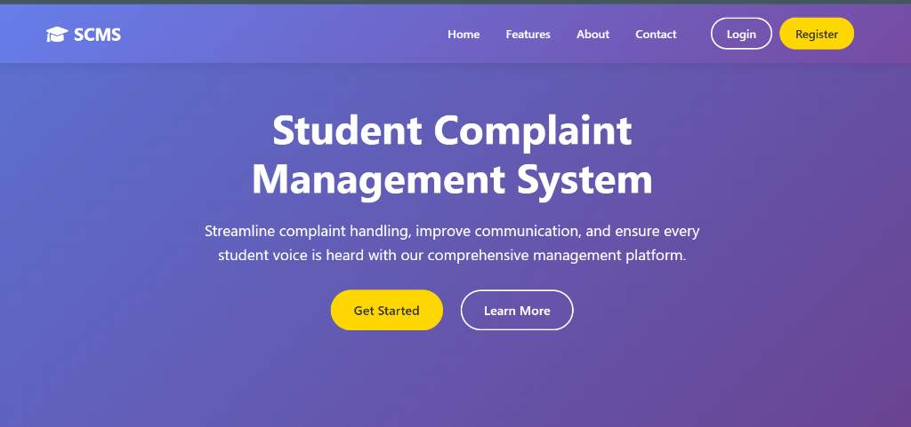

# 🎓 Student Complaint Management System (SCMS)

A premium, state-of-the-art PHP & MySQL-based web application designed to digitalize and streamline the process of handling student complaints in educational institutions. 

## 🚀 Features

### **For Students**
- **Modern Landing Page**: Professional and welcoming interface.
- **Secure Authentication**: Register and login with encrypted passwords.
- **File Complaints**: Submit detailed complaints with categorization.
- **Real-time Tracking**: Monitor the status of your complaints (Pending, In-Progress, Resolved).
- **Notifications**: Receive system alerts when your complaint status changes.

### **For Administrators**
- **Premium Dashboard**: Data-rich overview with interactive Chart.js visualizations.
- **Mini-Sidebar UI**: Professional toggleable sidebar with icon-only mode.
- **Complaint Lifecycle Management**: Assign complaints to staff, add official remarks, and update status.
- **User Management**: Provision and manage accounts for Students, Staff, and Admins.
- **Advanced Analytics**: Generate institutional reports and export data to CSV.

## 🛠️ Technology Stack
- **Backend**: PHP 8.x
- **Database**: MySQL / MariaDB
- **Frontend**: HTML5, Vanilla CSS3 (Custom Design System)
- **UI Framework**: Bootstrap 5 (for grid and components)
- **Charts**: Chart.js
- **Icons**: Font Awesome 6.0

## 📦 Installation & Setup

1. **Prerequisites**:
   - Install **XAMPP** or **WAMP**.
   - Ensure PHP 7.4+ is enabled.

2. **Database Setup**:
   - Open **phpMyAdmin**.
   - Create a new database named `student_complaints`.
   - Import the `database.sql` file provided in the root directory.

3. **Application Setup**:
   - Clone or copy the project to your `htdocs` folder.
   - Run `setup_database.php` in your browser to verify the connection and create default accounts.

## 🔑 Demo Credentials

| Role | Email | Password |
| :--- | :--- | :--- |
| **Admin** | `admin@example.com` | `admin123` |
| **Staff** | `staff@example.com` | `staff123` |

## 🎨 Design Philosophy
This system utilizes a **Premium Aesthetics** approach:
- **Glassmorphism**: Subtle transparencies and soft borders.
- **Dynamic UI**: Smooth transitions and micro-animations for interactive elements.
- **Response Layout**: Fully optimized for Desktop, Tablet, and Mobile viewing.
- **Modern Typography**: Powered by the 'Outfit' Google Font.

## 📄 License
This projects is open-source and available under the MIT License.  

## git commit
git add .
git commit -m "commit"
git push
